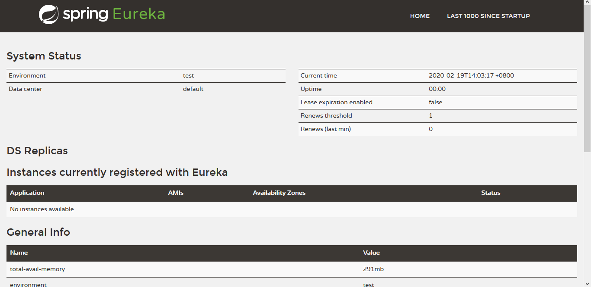

### SpringCloudDemo

- 创建一个空的 project（maven） 项目 **springcloud**，不需要任何依赖。

- 选中 **springcloud**  右键 model 创建注册中心 **eureka** （maven）

  -  **pom.xml** 
  
  ```xml
  <dependencies>
  	<!-- 配置 eureka 服务中心 -->
  	<dependency>
  		<groupId>org.springframework.cloud</groupId>
  		<artifactId>
         spring-cloud-starter-netflix-eureka-server
      </artifactId>
  		<version>2.2.1.RELEASE</version>
  	</dependency>
</dependencies>
  ```
  
  - **application.yml** 
  
    ```yaml
    server:
      port: 8761
    eureka:
      instance:
        hostname: localhost
      client:
        register-with-eureka: false
        fetch-registry: false
        service-url:
      		defaultZone: http://${eureka.instance.hostname}:${server.port}/eureka/
    ```
  
  - **EurekaApplication** 
  
    ```java
    package cn.dninth;
    
    import org.springframework.boot.SpringApplication;
    import org.springframework.boot.autoconfigure.SpringBootApplication;
    import org.springframework.cloud.netflix.eureka.server.EnableEurekaServer;
    
    
    @SpringBootApplication
    @EnableEurekaServer
    public class EurekaApplication {
        public static void main(String[] args) {
            SpringApplication.run(EurekaApplication.class, args);
        }
    }
    
    ```
  
- 启动 **EurekaApplication** 在浏览器地址栏输入 http://localhost:8761/ 即可进入 Eureka 管理服界面。

  
